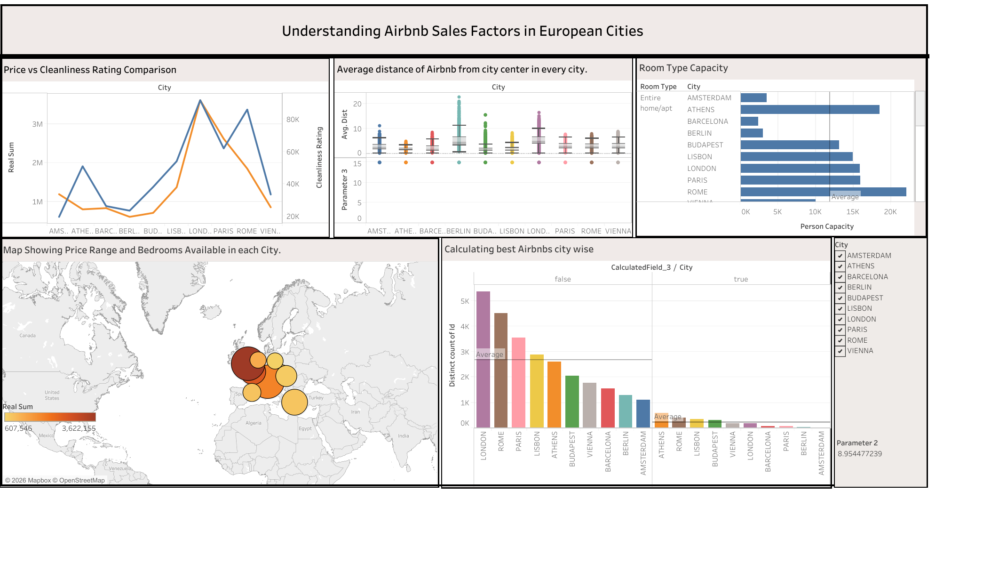
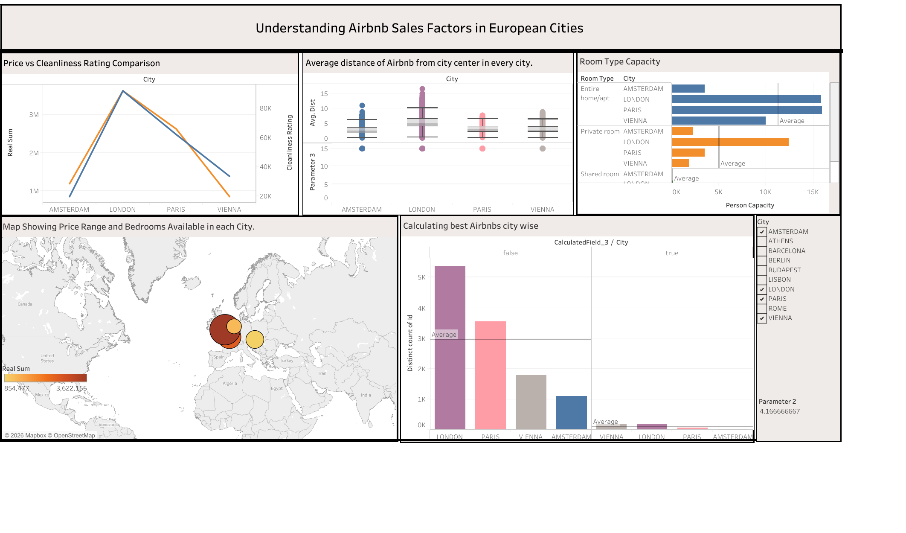

# Understanding Airbnb Sales Factors in European Cities

An interactive Tableau dashboard analyzing 51,707 Airbnb listings across 10 European cities (Amsterdam, Athens, Barcelona, Berlin, Budapest, Lisbon, London, Paris, Rome, and Vienna) to understand pricing, guest satisfaction, location, and business-traveler suitability.

**[View the live interactive dashboard on Tableau Public](https://public.tableau.com/app/profile/vikramaditya.chauhan/viz/Final_Project_Vikramchauhan/UnderstandingAirbnbSalesFactorsinEuropeanCities)**

## Dashboard

The dashboard combines 5 views into one interactive experience: Room Type Capacity, Price vs. Cleanliness Rating Comparison, Average Distance from City Center, Calculating Best Airbnbs City-Wise, and a Map of Price Range and Bedrooms Available. A city filter and parameter control apply across all 5 views at once — selecting a subset of cities updates every chart together:

## Key Findings

- **Entire home/apartment listings dominate the market** — 119,153 in total capacity vs. 42,972 for private rooms and just 1,355 for shared rooms.
- **Cleanliness is a consistent baseline, not a differentiator** — ratings stay comparatively narrow across all 10 cities regardless of price, while revenue varies considerably by city.
- **Weekend pricing carries a modest premium** over weekdays across all room types, consistent with leisure-driven demand.
- **London, Paris, and Amsterdam generate the most aggregate revenue**; Budapest, Athens, and Lisbon the least — though revenue leadership doesn't track purely with listing volume (Rome has a large market by listing count but comparatively lower revenue).
- **Business-suitable listings cluster near metro stations**, and only a small, consistent fraction of listings in any city qualify as both business-suitable and highly rated.

## Dataset

- Source: consolidated Airbnb pricing dataset for 10 European cities (Excel)
- 51,707 records, 22 fields: pricing, room type, host status, cleanliness/guest satisfaction ratings, location (distance from center/metro, lat/long)

## Tools Used

- Tableau (Desktop + Public)
- Excel (data source)
- MS Word (report)

## Calculated Fields

6 calculated fields support the analysis, including a business-suitability flag, a guest satisfaction percentage conversion, a combined "business + high rating" qualifier (>95% satisfaction, 9+ cleanliness, Superhost status), a moving average of revenue, and a city-to-postal-code mapping. Full formulas and purpose are documented in the report.

## Files

- `Final_Project_Vikramchauhan.twbx`: Packaged Tableau workbook (data included, opens directly in Tableau Desktop or Reader — no setup needed)
- `airbnbPricesInEuropeanCities_consolidated.xlsx`: Source dataset
- `visual_analytics_project_report_fin.docx`: Full report (dataset description, calculated fields, all 15 findings, dashboard walkthrough, conclusions)
- `dashboard-overview_png.png` / `dashboard-filtered-example_png.png`: Dashboard screenshots (unfiltered and filtered to a city subset)

## Future Work

- Incorporate time-series pricing data to capture seasonal trends beyond the weekday/weekend split
- Add review-text sentiment analysis alongside the numeric guest satisfaction scores
- Expand to additional European cities for broader market coverage

## 👤 Author
Vikramaditya Singh Chauhan
